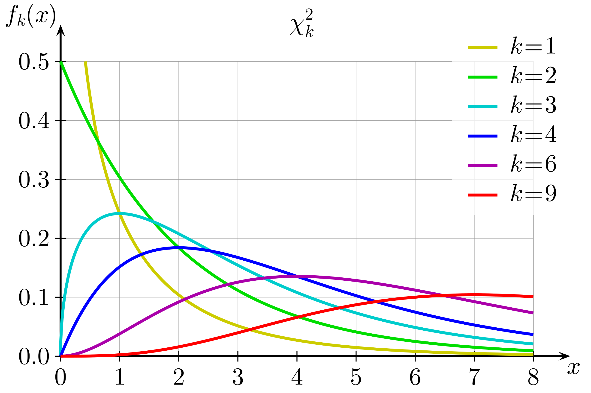

Description: A breakdown of basic statistics and its notation.

# Basic Statistics

### What is the bernoulli and binomial distribution ?

Bernoulli distribution: The random variable can either be 0 or 1. 
Binomial distribution: The random variable remains to have only two states, this shows the probability of measuring either state x number of times given n independent occurrences.

### What is the mean, expectation and standard deviation?

The mean is the frequency of each value occurring, multiplied by the value all summed for each random variable.

$\overline{x} = 1/n(\Sigma fx)$

The expectation is the probability of each value multiplied by the value, summed for all values. This is the value the mean tends to as the sample size increases.

$E(x) = \Sigma x P(X=x)$

The variance is the average of the squared difference from the mean.

$\sigma^2 = E(X^2) - (E(X))^2$

The standard deviation is the square root of the variance, showing essentially the average distance from the mean.

$\sigma$

An overall shift to all data points will effect expectation and not variance:

$E(X \pm a) = E(X) \pm a$

$Var(X \pm a) = Var(X)$

An overall multiplier to all data points effects both expectation and variance:

$E(aX) = aE(X)$

$Var(aX) = a^2Var(X)$

## Poisson Distribution

### What is the poisson distribution ?

- Random discrete variable is a count of the number of events occurring at random in regions of time and space.
  - All events are independent 
  - No two events at the same time
  - Over a short period of time or on a small region the probability is the same

$p_x = P(X=x) = e^-\lambda *\lambda^x/x!$ 

Recurrence formula:

$P(X=x) = \lambda/x * P(X= x-1)$

$\lambda$ is the mean var and $\sqrt(\lambda)$ is the std

95% of values are between the mean $\pm$ 2 std

Independent Poisson random variables can be added to give another Poisson random variable

## Continuos variables

### What is the difference between continuos and discrete variables ?

Discrete variables are a known list of possible numbers

Continuos random variables are infinite.

### What is relative frequency density and how does it translate to probability?

The relative frequency density; is a measurement of the relative frequency over a class width (interval between two values) 

$\frac{Relative frequency}{class width} = Relative frequency density$

The probability density function f(x); is the relative frequency density as n increases and the class width decreases

Area under a plotted f(x) gives the probability for that range of continuos variables.

$P(X<x) = \int_{-\infin}^{x} f(x)$

$\frac{d}{dx}P(X<x) = f(x)$

You cannot get the probability for a specific value via f(x):

$P(X=k) = 0$

### How do you calculate the Median?

The median value (m) is when the probability for values above and below are 0.5. 

$\int_{m}^{\inf} f(x) = 0.5$

### How do you calculate a Percentile?

The Xth percentile is the value below which the probability is X/100:

90th percentile

$P(X<x_{90th}) = 0.9$

### How do you calculate the Mean?

If assume the a small width of delta x, the mean will be $\sum x(f(x)\delta(x))$ (the brackets give the probabilty and multiplying by x gives the mean). As delta x tends to 0 this becomes:

$\bar{x} = \int xf(x)$

The population mean is then :

$\mu = \int_{-\infty}^{\infty} xf(x) dx$

The variance is:

$Var(x) = \int_{-\infty}^{\infty} (x -\mu)^2 f(x) dx$

## Estimation

### Confidence Interval

### what is a normal distribution ?

**Normal distribution** : Data set centered evenly about a value, giving a bell curve.

### How do you calculate the confidence interval ?

To calculate the confidence interval of a population mean, use the variable Z below, where $\bar{X}$ is variable corresponding to the sample mean:

$Z = (\bar{X} - \mu)/ (\sigma/ \sqrt{n}$)

For a normal distribution with mean 0 and std of 1 N(0,1) the confidence interval is:

$(\bar{x} - 1.96 (\sigma/\sqrt{n}),\bar{x} - 1.96 (\sigma/\sqrt{n}))$

The above interval on an average of 95% of the time will include the mean.

### What is a T Distribution?

If the the sample size is limited and below 30, then instead of a normal and T distribution is used.

A T dist has degrees of freedom (v) = n-1:

- A normal distribtion has degrees of freedom v = $\infty$
- n being the sample size

If the variance is unknown and n is large, Z can be adjusted to use s^2 which is an unbiased estimate of the variance. This gives two random variables in the equation X and S:

  $T = (\bar{X} - \mu)/ (S/\sqrt{n})$

c is the critical value depending on the distribution parameters and the confidence interval required:

$(\bar{x} + c(s\sqrt{n}),\bar{x} - c(s\sqrt{n}))$

### How is s calculated ?

$s^2 = 1/(n-1) * \sum(x-\bar{x})^2$

## Hypothesis testing

### What are the two hypothesis statements?

2 hypothesis are given the null ($H_o$) and the alternative ($H_1$):
- Null gives a specific parameter value 
- Alternative gives a range of values

Example of a parameter used is the population mean ($\mu$)

### How do you determine the confidence of a given null hypothesis ?

A normal distribution of N($\mu, \sigma^2$) can be related to N(0,1) by using $z = (\bar{x} - \mu)/ (\sigma/\sqrt{n})$.

A normal distribution if the variable is adjusted to be the sample mean $\bar{X}$ using the mean from the null hypothesis will become N($\mu_o,\sigma^2/n$).

This can then be used in the form:

$P(\bar{X} > x) = P(z > (x-\mu) /\sigma)$ ; This is then used to calculate the confidence percentage, from the tails of the distribution of a N(0,1)

**Two tailed tests gives a much more complete analysis of the data set**

### What are some basic terms ?

*Test statistic* : Function of data used to determine between $H_o$ and$H_1$ 

*The critical region*: Values that lead to rejection of $H_o$ in favour of $H_1$ is the critical region.

*Significance level*: The probability $H_o$ is rejected for $H_1$

### What are the error types ?

*Type 1 error*: $H_0$ is rejected for $H_1$ however it was correct; This is mitigated by choosing a low significance level.

*Type 2 error*: $H_o$ is accepted but incorrect.

### What is the suggested test procedure ?

1. State the two hypothesis (Null and alternative)
2. Choose the appropriate test statistic and distribution
3. Choose significance level
4. Collect data
5. Analyze

To avoid bias the sig level should be chosen before any data is collected

If the dataset is approximately normal dist then use the standard N(0,1)

### How does confidence level relate to significance level ?

If $\mu_0$ is outside the range of $\alpha$% confidence level, then the significance level is (100-$\alpha$%)

## Chi squared dist

Uses the standard v degrees of freedom.

Only used for non negative random variables (generally for freq measurements) to determine if two variables are dependant or independent. This includes if a variable is bias by comparing it to the expected non bias result.

As shown it is a skewed dist, as v increases the skew decreases.

### How do you test for bias?

The difference between the expected (non bias result) and the observed result will indicate bias.

Both size and relative size matter:

$(O-E) * (O-E)/E = (O-E)^2/E$

O: Observed, E: Expected

### What value is used to determine goodness of fit between two models?

$X^2 = \sum^{m}_{i=1} (O_i - E_i)^2/E_i$ 

Where m is the number of different outcomes for each model (columns).

**Large value of $X^2$ suggest a lack of fit**

### How does $X^2$ relate to Chi squared ?

Chi squared dist approximately shows the probability distribution of $X^2$, if the freq values > 5 :

$X^2 = \Chi^2_{m-1}$

### What is a contingency table ?

A table with more than two variables being measured against (two+ rows)

The degree of freedom is : $v= (r-1)(c-1)$

r: rows, c: columns

**If $X^2$ is within the chi squared 95% interval it should be accepted as independent**

### What should you do with a 2x2 table ?

Can use the alternative:

$X^2 = \sum (|O-E|-0.5)^2/E$